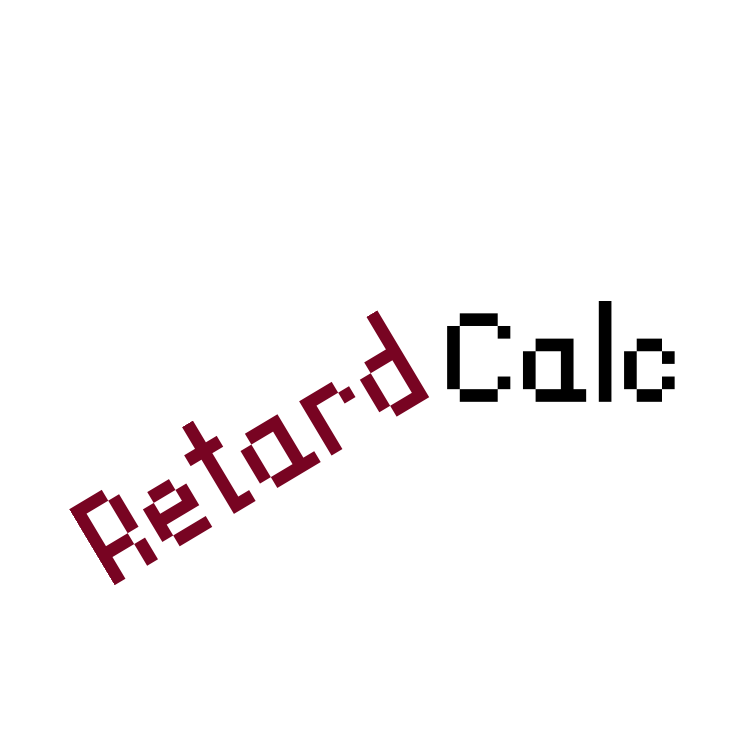
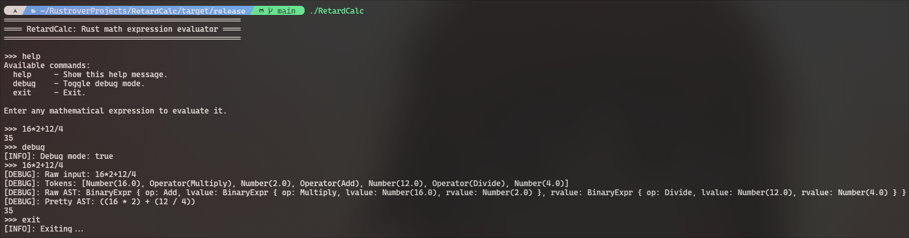

<h1> RetardCalc </h1>

# Introduction
**RetardCalc** is my first rust project which I made just for fun. Don't expect much from it.  
This project uses Abstract Syntax Tree (AST) to evaluate expressions. Proccess is pretty simple:  
1. lexer::tokenize Parses string into Tokens array.
2. parser.parse() Builds AST Nodes from Tokens and links them.
3. evaluator::eval() Evaluates AST Nodes and returns result.

## Available Functions

### Arithmetic Operations
- **Addition:** `x + y`
- **Subtraction:** `x - y`
- **Multiplication:** `x * y`
- **Division:** `x / y`

### Exponent and Logarithmic Operations
- **Exponentiation:** `x ^ y`
- **Square root:** `sqrt x`
- **Logarithm:** `x log y` (where x is base, y is argument)
- **Natural logarithm:** `ln x`

### Trigonometric Functions
- **Cosine:** `cos x`
- **Sine:** `sin x`
- **Tangent:** `tan x`
- **Arccosine:** `acos x`
- **Arcsine:** `asin x`
- **Arctangent:** `atan x`

### Miscellaneous Operations
- **Negation:** `-x`
- **Modulo (remainder):** `x % y`
- **Absolute value:** `abs x`
- **Rounding:** `round x`

### Unknown
- **Default value:** Invalid input

# Screenshot

