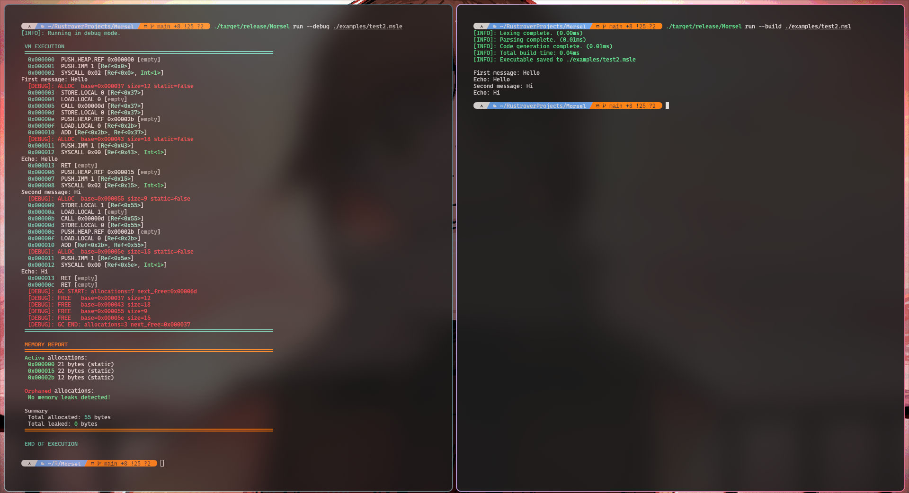

<div align="center">
<h1> Morsel </h1>

</div>

> [!WARNING]
>
> Under development. It's my first Rust project, expect bugs and occasional existential crisis from the compiler.
> Check [Roadmap](#roadmap) for implemented parts of the language (kind of).

# Introduction

**Morsel** is an **interpreted** programming language built in **Rust** as my first Rust project. It combines memory
safety of GC languages with type safety of Rust with an easy, expression-based syntax inspired by C, Go, and Rust
itself.

## Why Morsel?

I liked the word "morsel". And, it sounds vaguely edible, which is always a plus.


# Documentation

Documentation for different aspects of Morsel:

- **[Syntax Guide](doc/SYNTAX.md)** - Learn the language syntax
- **[Bytecode and VM](doc/BYTECODE.md)** - Understand the bytecode instruction set, stack model, and virtual machine
  architecture

# Quick Start

### Hello world

```morsel
func main() {
    println("Hello, Morsel!");
}
```

Run it with:

```bash
morsel build hello.msl
morsel run hello.msle
```

# Features

Morsel combines some unique features that set it apart from typical interpreted languages:

- **Static Type System with Inference** - Catch type errors before execution while using automatic
  type inference (no need for verbose type annotations everywhere!).
- **Immutability by Default** - Variables are immutable unless explicitly marked with `mut`.
- **Stack-Based Bytecode VM** - A custom-built virtual machine which operates on stack. Very cool!!!
- **Compile-Time Safety Checks** - Semantic analyzer enforces safety rules before code generation, preventing *most*
  runtime errors.
- **Explicit Control Flow** - No implicit type conversion or hidden control flow. What you write is what executes.
- **Garbage Collection** - Efficient tracing garbage collector which manages memory and enforces memory safety.
- **Built in Rust** - Because everything should be. Including programming languages, apparently.

# Installation

Clone the repository and build with Cargo:

```bash
git clone https://github.com/bazelik-null/Morsel.git
cd Morsel
cargo build -r
```

# Compiler Pipeline

`[Source code] -> [Lexer] -> [Parser] -> [Semantic analyzer] -> [Code generator] -> [Linker] -> [Executable]`

## Architecture Overview

**`src/core`** - Morsel compiler and VM code

- **`./compiler`** - Morsel compiler
    - **`./preprocessor`** - Lexer which tokenizes raw input and merges files
    - **`./parser`** - Builds AST from tokens
        - **`./parser/analyzer.rs`** - Analyzes AST and enforces safety rules
    - **`./codegen`** - Generates bytecode from AST
    - **`./linker`** - Resolves label and data IDs, patches instructions

# Roadmap

- [x] Syntax specification
- [x] Error handling
- [x] Lexer
- [x] Parser
- [x] Semantic analyzer
- [x] Type safety
- [ ] Type casting
- [x] Bytecode specification
- [x] Compiler
- [x] Math expressions
- [x] Variables
- [x] Functions
- [x] Control flow (if/else statements, loops, etc)
- [x] Basic virtual machine
- [x] Hard built-in functions (for debug)
- [x] Memory management (stack, heap, etc)
- [x] Tracing garbage collector
- [ ] Arrays and data structures
- [ ] Imports and namespaces
- [ ] Built-in std library (print(), input())
- [ ] Full virtual machine
- [ ] Additional std library functions
- [ ] Performance optimizations
- [ ] **First release**

# Screenshot


